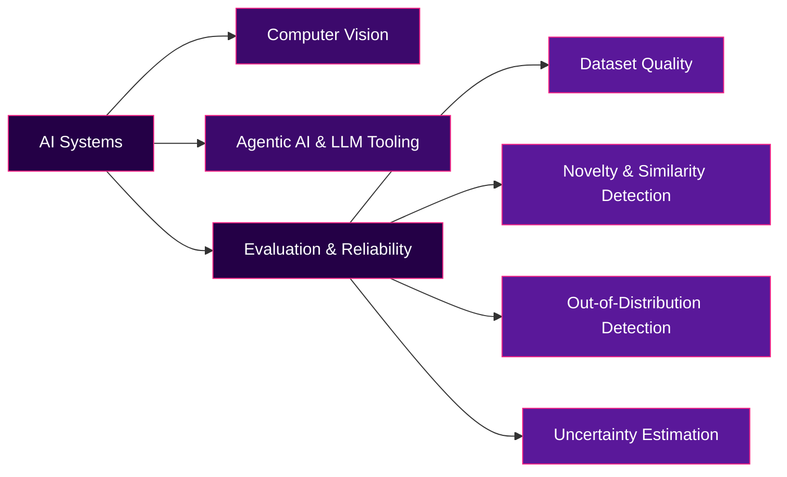

  

  

 

Building at the intersection of **computer vision**, **agentic AI**, and **ML systems that know their own limits** — increasingly focused on how models fail gracefully, not just how they succeed.

 

## ⚡ Current Focus

<i>Does this model get the right answer — or does it know when it might be wrong?</i>

 

**Evaluation & Reliability Toolkit:**

 

---

## 🚀 Featured Projects

<table>
<tr>
<td width="50%" valign="top">

### 🏙️ Aerial Building Footprint Detection
Two-stage pipeline — a lightweight classifier gates an expensive segmenter.
**`96.8%`** classification accuracy · **`0.645 IoU / 0.785 Dice`**
Manual error analysis uncovered a real roof-color shortcut bias the aggregate metrics missed entirely.

  

</td>
<td width="50%" valign="top">

### 🤖 AI Resume Scoring Agent
LLM agent using forced tool-calling for guaranteed structured output.
Schema deliberately orders reasoning **before** score, so reasoning drives the result.
Full automation chain: Flask → n8n → email.

  

</td>
</tr>
<tr>
<td width="50%" valign="top">

### 🚗 Vehicle Classification & Detection
**🏆 Best Paper Award**
Comparative study — YOLOv11 vs RT-DETR vs YOLOv9 across two driving datasets. No single model won universally — a genuinely dataset-dependent finding. Team project: led data labeling, training, and the paper itself.

 

</td>
<td width="50%" valign="top">

### 💊 Drug-to-Drug Interaction Prediction
Multi-modal deep learning across chemical structure, target, and enzyme similarity — classifying across 65 interaction event types. Team project: built and trained the models.

 

</td>
</tr>
<tr>
<td colspan="2" valign="top">

### 🦴 X-Ray Fracture Detection & Segmentation
Two-stage pipeline — ResNet-18 classifier gates a YOLO instance-segmentation model. Native DICOM support, plus a heuristic pre-check that filters non-X-ray uploads before either model runs.

    

</td>
</tr>
</table>

---

## 💻 Stack & Environment

  

---

---

## 📊 GitHub Activity

  

---

 

