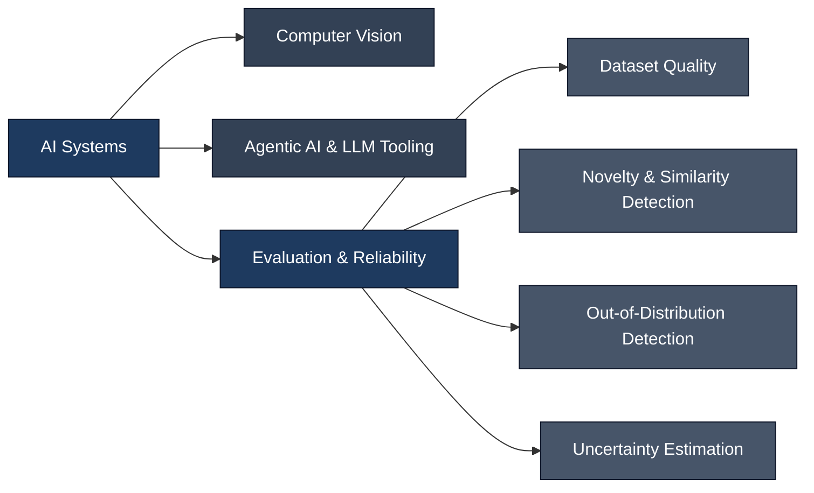

<div align="center">


</div>

<br>

```bash
$ whoami
Computer Science student — building in computer vision, agentic AI, and reliable ML systems

$ status
Currently exploring how to make AI systems know what they don't know
```

<br>

## 🧭 Current Focus



Increasingly, my work sits less in "does this model get the right answer" and more in **"does this model know when it might be wrong"** — dataset quality, novelty detection, and out-of-distribution reasoning are where most of my current learning is going.

---

## 🚀 Projects

<table>
<tr>
<td width="50%" valign="top">

**🏙️ Aerial Building Footprint Detection**
Two-stage pipeline — a lightweight classifier gates an expensive segmenter. `96.8%` classification accuracy, `0.645 IoU / 0.785 Dice`. Manual error analysis uncovered a real roof-color shortcut bias the aggregate metrics missed entirely.
`PyTorch` `EfficientNet-B0` `DeepLabV3+`

</td>
<td width="50%" valign="top">

**🤖 AI Resume Scoring Agent**
LLM agent using forced tool-calling for guaranteed structured output — schema deliberately orders reasoning before score, so the reasoning actually drives the result. Full automation chain: Flask → n8n → email.
`Gemini API` `Flask` `n8n`

</td>
</tr>
<tr>
<td width="50%" valign="top">

**🚗 Vehicle Classification & Detection** 🏆 *Best Paper Award*
Comparative study — YOLOv11 vs RT-DETR vs YOLOv9 across two driving datasets. No single model won universally, a genuinely dataset-dependent finding. Team project — led data labeling, training, and the paper itself.
`Ultralytics YOLO` `RT-DETR`

</td>
<td width="50%" valign="top">

**💊 Drug-to-Drug Interaction Prediction**
Multi-modal deep learning across chemical structure, target, and enzyme similarity, classifying across 65 interaction event types. Team project — built and trained the models.
`TensorFlow` `Keras` `scikit-learn`

</td>
</tr>
<tr>
<td colspan="2" valign="top">

**🦴 X-Ray Fracture Detection & Segmentation**
Two-stage pipeline — ResNet-18 classifier gates a YOLO instance-segmentation model. Native DICOM support, plus a heuristic pre-check that filters non-X-ray uploads before either model runs.
`PyTorch` `Ultralytics YOLO` `OpenCV` `pydicom` `Streamlit`

</td>
</tr>
</table>

---

## 🛠️ Stack

<div align="center">


</div>

---

## 📜 Certifications

- **Image Processing Onramp** — MathWorks
- **Fundamentals of Reinforcement Learning** — University of Alberta (Coursera)
- **Learn to Hack Real-Time Web Applications** — NullClass
- **Selenium Python Automation Testing** — Infosys
- **Agile Kanban Certification** — Infosys

---

## 📊 GitHub Activity

<div align="center">
  
</div>

---

<div align="center">

[](https://www.linkedin.com/in/adithyanaik05/)
[](https://github.com/AdithyaNaikk)
[](mailto:naikadithya904@gmail.com)


</div>
